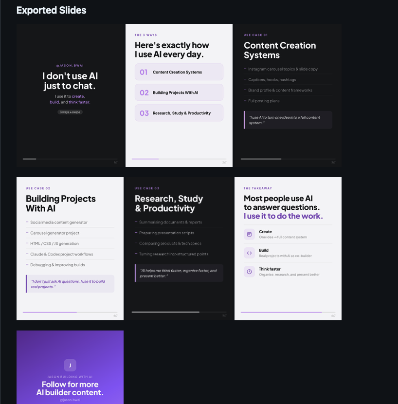
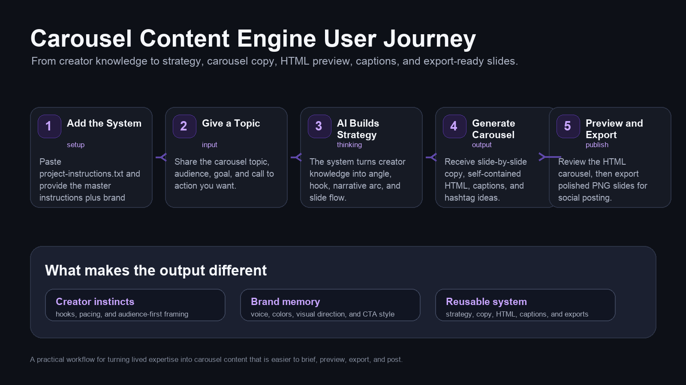

# Carousel Content Engine

A reusable instruction kit for generating branded, swipeable Instagram carousel content with AI.

This repo contains the operating rules, brand profile, and master carousel instructions used to create polished carousel concepts, self-contained HTML previews, captions, and export-ready PNG slides.

## Preview

Example carousel: **The 3 Ways I Actually Use AI**

### HTML Interface


### Exported Slides



## How It Works



## Why This Is Different

This is not just another carousel-making prompt or generic design template.

The system is built around a simple belief: good carousels come from good thinking. A strong carousel is not only about layout, colors, or slide formatting. It needs a clear point of view, a sharp audience insight, and content that feels useful enough for people to save, share, or act on.

This system was developed by a content creator with 300K+ followers online and more than 35 million views worldwide, distilling practical content knowledge into a repeatable carousel content machine.

Instead of starting from a blank prompt, it gives AI a stronger creative operating system:

- hooks built around audience attention
- slide flow shaped by creator experience
- practical, non-generic content structure
- branded visual consistency
- captions designed for social distribution
- prompts that preserve personal voice

The goal is not to mass-produce empty carousels. The goal is to help creators and builders turn lived knowledge into content that matters to the audience.

## References

For background on the creator behind this system:

- [LinkedIn profile](https://my.linkedin.com/in/jasonngjiexin)
- [Instagram: @jasonng_7](https://www.instagram.com/jasonng_7/)

## What's Inside

| File | Purpose |
|---|---|
| `project-instructions.txt` | Copy/paste this into your AI project's instruction field. |
| `carousel-master-instructions.md` | Full carousel generation system: strategy, copy, design, HTML, captions, and export guidance. |
| `creator-brand-profile.md` | Jason Building With AI brand identity, tone, colors, content pillars, and visual direction. |
| `assets/html-interface-preview.png` | Screenshot preview of the generated HTML carousel interface. |
| `assets/exported-slides-preview.png` | Screenshot preview of the exported slide grid. |
| `assets/user-journey-diagram.png` | Visual overview of the tool workflow. |

## How To Use This Repo

Use the three instruction files as the source of truth whenever you ask an AI assistant to create a carousel.

### 1. Start With The Instruction Files

Give your AI assistant these files:

1. `project-instructions.txt`
2. `carousel-master-instructions.md`
3. `creator-brand-profile.md`

Paste `project-instructions.txt` into your project instructions. Then attach or provide the two supporting files and ask for a carousel using a simple request like:

```text
Using the uploaded carousel execution rules, master instructions, and brand profile, create an Instagram carousel about:

Topic: 3 ways I actually use AI in my daily business workflow
Goal: Educate business owners and creators
Audience: AI-curious founders, creators, and solopreneurs
CTA: Follow @jason.bwai for practical AI workflows

Please generate:
- carousel strategy
- slide-by-slide copy
- self-contained HTML carousel
- short Instagram caption
- long Instagram caption
- hashtags
```

### 2. Generate The HTML Carousel

Ask the AI assistant to output a single self-contained `.html` file that includes:

- HTML
- CSS
- JavaScript
- carousel navigation
- swipe support
- keyboard navigation
- Instagram-style preview frame
- export-ready slide containers

Save the generated file with a descriptive name, for example:

```text
carousel-3-ways-i-use-ai.html
```

### 3. Export PNG Slides

Ask the AI assistant to generate a Playwright export script for the HTML carousel, or use your preferred browser screenshot workflow.

Recommended export format:

- slide size: `1080 x 1350 px`
- file naming: `slide-01.png`, `slide-02.png`, etc.
- output folder: `exports-[carousel-name]/`

Example:

```text
exports-3-ways-i-use-ai/
  slide-01.png
  slide-02.png
  slide-03.png
  slide-04.png
  slide-05.png
  slide-06.png
  slide-07.png
```

### 4. Preview Locally

Open the generated HTML file in your browser to preview the carousel interface.

You can also view exported slides locally after export:

```text
exports-3-ways-i-use-ai/
  slide-01.png
  slide-02.png
  slide-03.png
  slide-04.png
  slide-05.png
  slide-06.png
  slide-07.png
```

This gives you the same slide-grid preview style shown below.

### 5. Publish Or Reuse

Use the exported PNG slides for Instagram, LinkedIn, X, or other social platforms. Keep the HTML file as the editable source version, and regenerate PNGs whenever you update copy or design.

## Recommended Workflow

1. Pick one topic and one clear objective.
2. Use the execution rules, master instructions, and brand profile as context.
3. Generate strategy and slide-by-slide copy first.
4. Generate the self-contained HTML carousel.
5. Review the HTML in a browser.
6. Export slides as PNGs.
7. Use the generated captions and hashtags when posting.
